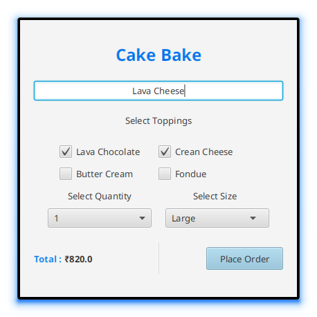

<div align = "center">

<h1><a href="https://2kabhishek.github.io/cakebake">Cake Bake</a></h1>

<a href="https://github.com/2KAbhishek/cakebake/blob/main/LICENSE">
 </a>

<a href="https://github.com/2KAbhishek/cakebake/pulse">
 </a>

<a href="https://github.com/2KAbhishek/cakebake/stargazers">
</a>

<a href="https://github.com/2KAbhishek/cakebake/network/members">
 </a>

<a href="https://github.com/2KAbhishek/cakebake/watchers">
 </a>

<a href="https://github.com/2KAbhishek/cakebake/graphs/contributors">
 </a>

<a href="https://github.com/2KAbhishek?tab=followers">
 </a>

<h3>Bake some cakes 🎂👨🏼‍🍳</h3>

<figure>
  
  <br/>
  <figcaption>cakebake screenshot</figcaption>
</figure>

</div>

## What is this

CakeBake is a GUI application that let's you generate Cake orders using a friendly user interface.

## Inspiration

Wanted to explore JavaFx a bit more, thought of this.

## Prerequisites

Before you begin, ensure you have met the following requirements:

- You have installed the latest version of `java`, `javafx`

## Getting cakebake

To get cakebake, follow these steps:

```bash
git clone https://github.com/2kabhishek/cakebake
cd cakebake
code . # With Java extensions installed
# Run CakeBake.java
```

## Using cakebake

Once the app is running, you can select various options from the UI and clicking on `Place Order` will save the order to `orders.txt` file.

## How it was built

cakebake was built using `javafx`

## Challenges faced

Building the UI exactly as I wanted with FXML was somewhat challenging.

## What I learned

- Got to learn more about JavaFX and how powerful it is.
- Discovered various new components in FXML and how to use them.

Hit the ⭐ button if you found this useful.

## More Info

<div align="center">

<a href="https://github.com/2KAbhishek/cakebake">Source</a> | <a href="https://2kabhishek.github.io/cakebake">Website</a>

</div>
